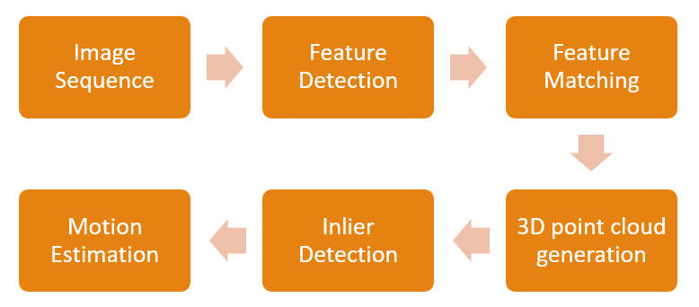
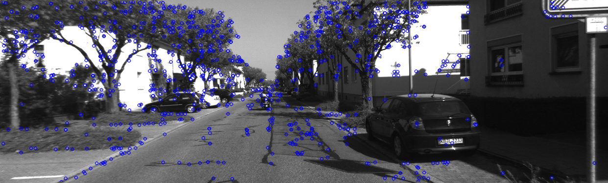
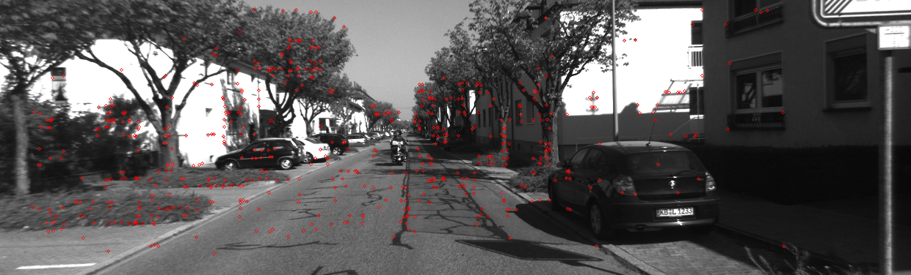
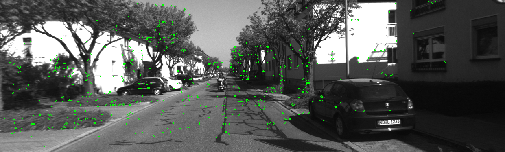
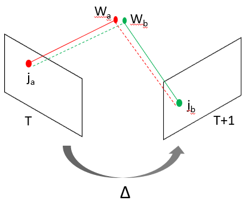
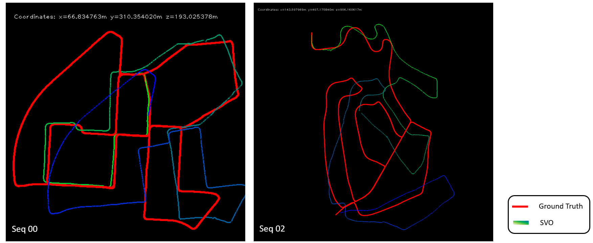
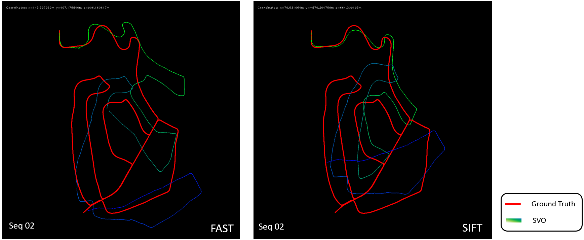
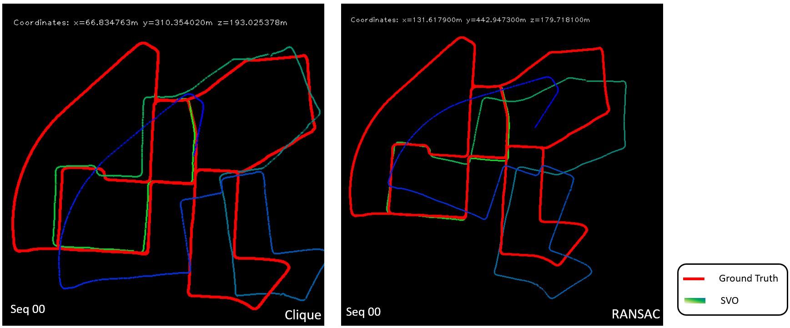

  Stereo Visual Odometry 
Chirayu Garg, Utkarsh Jain 
 University of Wisconsin-Madison 
 {cgarg2, utkarsh.jain}@wisc.edu

# Introduction

Localization is an essential feature for autonomous vehicles and therefore Visual Odometry has been a well investigated area in robotics vision. Visual Odometry helps augment the information where conventional sensors such as wheel odometer and inertial sensors such as gyroscopes and accelerometers fail to give correct information. Visual odometry estimates vehicle motion from a sequence of camera images from an onboard camera. It produces full 6-DOF (degrees of freedom) motion estimate, that is the translation along the axis and rotation around each of co-ordinate axis.

 Over the years, visual odometry has evolved from using stereo images to monocular imaging and now incorporating LiDAR laser information which has started to become mainstream in upcoming cars with self-driving capabilities. It is also a prerequisite for applications like obstacle detection, simultaneous localization and mapping (SLAM) and other tasks. Visual-SLAM (VSLAM) is a much more evolved variant of visual odometry which obtain global, consistent estimate of robot path. The path drift in VSLAM is reduced by identifying loop closures.
 
Some of the challenges encountered by visual odometry algorithms are:
1.	Varying lighting conditions
2.	In-sufficient scene overlap between consecutive frames
3.	Lack of texture to accurately estimate motion

## Types of Visual Odometry

* ### Monocular Visual Odometry
A single camera is used to capture motion. Usually a five-point relative pose  estimation method is used to estimate motion, motion computed is on a relative scale. Typically used in hybrid methods where other sensor data is also available.

* ### Stereo Visual Odometry
A calibrated stereo camera pair is used which helps compute the feature depth between images at various time points. Computed output is actual motion (on scale). If only faraway features are tracked then degenerates to monocular case.

# Algorithm Description
Our implementation is a variation of [1] by Andrew Howard. We have used KITTI visual odometry [2] dataset for experimentation. All the computation is done on grayscale images. The top level pipeline is shown in figure 1.

 Figure 1: Stereo Visual Odometry Pipeline 

* ## Input Image sequence
Capture  stereo image pair at time T and T+1. The images are then processed to compensate for lens distortion. To simplify the task of disparity map computation stereo rectification is done so that epipolar lines become parallel to horizontal. In KITTI dataset the input images are already corrected for lens distortion and stereo rectified.

* ## Feature Detection
Features are generated on left camera image at time T using FAST (Features from Accelerated Segment Test) corner detector. FAST is computationally less expensive than other feature detectors like SIFT and SURF. To accurately compute the motion between image frames, feature bucketing is used. The image is divided into several non-overlapping rectangles and a maximum number (10) of feature points  with highest response value are then selected from each bucket. There are two benefits of bucketing: i) Input features are well distributed throughout the image which results in higher accuracy in motion estimation. ii) Due to less number of features computation complexity of algorithm is reduced which is a requirement in low-latency applications. Disparity map for time T is also generated using the left and right image pair.

Figure 2: FAST Features 

* ## Feature Tracking
Features generated in previous step are then searched in image at time T+1. The original paper [1] does feature matching by computing the feature descriptors and then comparing them from images at both time instances. More recent literature uses KLT (Kanade-Lucas-Tomasi) tracker for feature matching. Features from image at time T are tracked at time T+1 using a 15x15 search windows and 3 image pyramid level search. KLT tracker outputs the corresponding coordinates for each input feature and accuracy and error measure by which each feature was tracked. Feature points that are tracked with high error or lower accuracy are dropped from further computation.

Figure 3: Features at time T 

Figure 4: KLT tracked features at time T+1 

* ## 3D Point Cloud Generation
Now that we have the 2D points at time T and T+1, corresponding 3D points with respect to left camera are generated using disparity information and camera projection matrices. For each feature point a system of equations is formed for corresponding 3D coordinates (world coordinates) using left, right image pair and it is solved using singular value decomposition to obtain 3D points.

* ## Inlier Detection
Instead of an outlier rejection algorithm this paper uses an inlier detection algorithm which exploits the rigidity of scene points to find a subset of consistent 3D points at both time steps. The key idea here is the observation that although the absolute position of two feature points will be different at different time points the relative distance between them remains the same. If any such distance is not same, then either there is an error in 3D triangulation of at least one of the two features, or we have triangulated is moving, which we cannot use in the next step. 

* ## Motion Estimation
Frame to frame camera motion is estimated by minimizing the image re-projection error for all matching feature points. Image re-projection here means that for a pair of corresponding matching points Ja and Jb at time T and T+1, there exits corresponding world coordinates Wa and Wb. The world coordinates are re-projected back into image using a transform (delta) to estimate the 2D points for complementary time step and the distance between the true and projected 2D point is minimized using Levenberg-Marquardt least square optimization.

 Figure 5: Image Reprojection : Wb --> Ja  and Wa --> Jb  

# Results
We have implemented above algorithm using Python 3 and OpenCV 3.0 and source code is maintained [here](https://github.com/cgarg92/Stereo-visual-odometry/). KITTI visual odometry [2] dataset is used for evaluation. In the KITTI dataset the ground truth poses are given with respect to the zeroth frame of the camera. Following video shows a short demo of trajectory computed along with input video data.
<video src="./docs/demoVideo.mp4" width="900" height="350" controls preload></video>

Demo Video 
 

Figure 6 illustrates computed trajectory for two sequences. For linear translational motion the algorithm tracks ground truth well, however for continuous turning motion such as going through a hair pin bend the correct angular motion is not computed which results in error throughout the latter estimates. For very fast translational motion the algorithm does not perform well because of lack of overlap between consecutive images.

Figure 6: Output trajectory for sequence 00 and 02 from KITTI dataset  

Variation of algorithm using SIFT features instead of FAST features was also tried, a comparison is shown in figure 7. At certain corners SIFT performs slightly well, but we cant be certain and after more parameter tuning FAST features can also give similar results. Figure 8 shows a comparison between using clique based inlier detection algorithm versus RANSAC to find consistent 2D-3D point pair. RANSAC performs well at certain points but the number of RANSAC iteration required is high which results in very large motion estimation time per frame.

Figure 7: Output trajectory for sequence 02 for FAST and SIFT features  

Figure 8: Output trajectory for sequence 00 for Clique inlier detection and RANSAC outlier rejection  

# Discussion & Future work
The results obtained match the ground truth trajectory initially, but small errors accumulate resulting in egregious poses if algorithm is run for longer travel time. It is to be noted that although the absolute position is wrong for latter frames the relative motion (translation and rotation) is still tracked. SLAM characteristics like loop closure can be used to help correct the drift in measurement.

There are several tunable parameters in the algorithm which can be tuned to adjust the accuracy of output, some of the parameters are: block size for disparity computation and KLT tracker, various error thresholds such as for KLT tracker, feature re-projection, clique rigidity constraint. More work is required to develop an adaptive framework which adjusts their parameters based on feedback and other sensor data. 

All brightness-based motion tracker perform poorly for sudden changes in image luminance, therefore a robust brightness invariant motion tracking algorithm is needed to accurately predict motion. Neural networks such as Universal Correspondence Networks [3] can be tried out but the real-time runtime constrains of visual odometry may not accommodate for it. A faster inlier detection algorithm is also needed to speed up the algorithm, added heuristics such as an estimate how accurate each feature 2D-3D point pair is can help with early termination of inlier detection algorithm. 

# References
[1] A. Howard. Real-time stereo visual odometry for autonomous ground vehicles. In IEEE Int. Conf. on Intelligent Robots and Systems , Sep 2008

[2] http://www.cvlibs.net/datasets/kitti/eval_odometry.php

[3] C. B. Choy, J. Gwak, S. Savarese and M. Chandraker. Universal Correspondence Network. NIPS , 2016

## Note
The powerpoint presentation for same work can be found [here](./docs/StereoVisualOdometry_Grp17.pptx)
